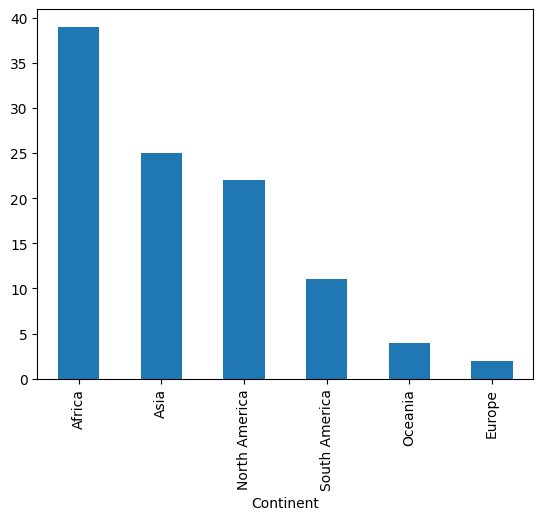
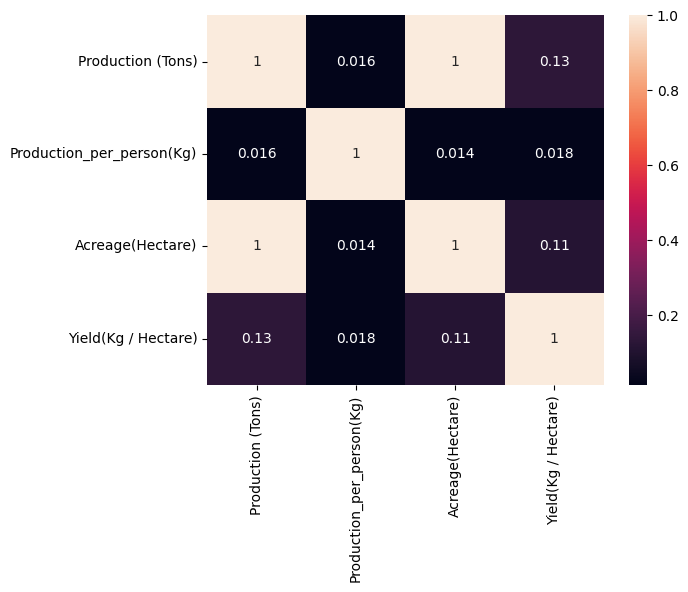
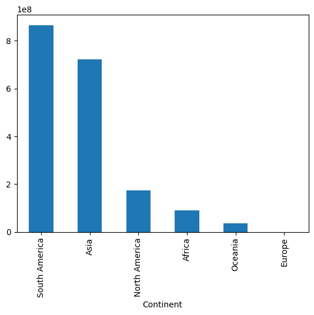

# 🌾 Sugarcane Production EDA

Exploratory Data Analysis of global sugarcane production, examining production volume, land usage, and yield per hectare across countries and continents.

## 📌 Overview

This project analyzes global sugarcane production data to uncover patterns in how much sugarcane different countries and continents produce, how efficiently they use land, and how production is distributed worldwide. The analysis covers:

- Data cleaning and preprocessing (handling inconsistent number formats, missing values, and data types)
- Univariate analysis of production, acreage, and yield distributions
- Bivariate analysis exploring relationships between land use, yield, and total production
- Continent-level comparison of sugarcane production

**Key questions explored:**
- Which countries and continents dominate global sugarcane production?
- Does more land under cultivation always mean higher production?
- Does higher yield per hectare translate to higher total production?

## 📊 Dataset

The dataset used is **"List of Countries by Sugarcane Production"**, containing sugarcane production statistics for 102 countries across 6 continents.

**Columns:**
| Column | Description |
|---|---|
| Country | Name of the country |
| Continent | Continent the country belongs to |
| Production (Tons) | Total sugarcane production in tons |
| Production per Person (Kg) | Sugarcane production per capita in kg |
| Acreage (Hectare) | Land area used for sugarcane cultivation in hectares |
| Yield (Kg/Hectare) | Sugarcane yield per hectare in kg |

📁 The raw dataset is included in this repo under [`data/List_of_Countries_by_Sugarcane_Production.csv`](data/List_of_Countries_by_Sugarcane_Production.csv).

## 🧹 Data Cleaning

Before analysis, the raw dataset required several cleaning steps to make it usable:

1. **Fixed number formatting** — Numeric columns used European-style formatting (periods as thousand separators, commas as decimal points). Removed periods from `Production (Tons)` and `Acreage (Hectare)`, and standardized decimal notation in `Production per Person (Kg)` and `Yield (Kg/Hectare)`.
2. **Standardized column names** — Removed extra spaces and inconsistent naming for consistency (e.g., `Production (Tons)` → `Production(Tons)`).
3. **Handled missing values** — `Acreage(Hectare)` and `Yield(Kg/Hectare)` each had 1 missing value, filled using the **median** to reduce sensitivity to outliers (a few countries have extremely high production/yield values).
4. **Removed unwanted columns** — Dropped an auto-generated index column (`Unnamed: 0`).
5. **Converted data types** — Cast `Production(Tons)`, `Production_per_person(Kg)`, `Acreage(Hectare)`, and `Yield(Kg/Hectare)` to `float` for numerical analysis.
6. **Checked for duplicates** — Confirmed no duplicate rows in the dataset.

## 🔍 Analysis

### Univariate Analysis
- Counted the number of sugarcane-producing countries by continent.
- Examined the distribution of `Production(Tons)`, `Production_per_person(Kg)`, `Acreage(Hectare)`, and `Yield(Kg/Hectare)` using histograms — production and per-person production are heavily right-skewed, dominated by a handful of countries.
- Used boxplots to visually detect outliers — Brazil, India, and China stand out as extreme high-production outliers.



### Bivariate Analysis
- Calculated each country's share of global production (%) and visualized the top contributors with a pie chart.
- Identified the countries with the largest sugarcane acreage using a bar plot.
- Identified the single highest-producing country.
- Built a correlation heatmap to examine relationships between variables:
  - **Production vs. Acreage** — strong positive correlation, meaning larger land area under cultivation is strongly linked to higher total production.
  - **Production vs. Yield** — weak correlation, meaning higher yield per hectare doesn't necessarily translate to higher total output (smaller countries can be very efficient without producing the most overall).
- Used scatter plots to visually confirm these relationships.



### Continent-Level Analysis
- Aggregated production totals by continent to compare regional output.
- Explored whether the *number* of producing countries in a continent affects total production — found that a continent can lead in total production with relatively few countries, if it includes a dominant producer (e.g., South America driven largely by Brazil).



## 💡 Key Insights

- **Brazil is the world's leading sugarcane producer**, accounting for ~40.7% of total global production.
- **Africa has the most sugarcane-producing countries (39)**, followed by Asia (25) and North America (22) — but count of countries doesn't determine total output.
- **South America leads in total production volume** despite having only 11 producing countries, driven largely by Brazil's dominance.
- **Production is almost perfectly correlated with acreage** (correlation ≈ 0.998) — countries with more land dedicated to sugarcane consistently produce more.
- **Yield per hectare has little correlation with total production** (correlation ≈ 0.13) — some countries are highly efficient per hectare without being top overall producers, showing that land area, not farming efficiency alone, drives total output.
- **Guatemala has the highest yield per hectare**, and **Paraguay leads in production per person**, highlighting that efficiency and total scale are separate stories in this dataset.

## 🛠️ Tools & Technologies

- **Python 3**
- **Pandas** — data cleaning and manipulation
- **NumPy** — numerical operations
- **Matplotlib** — data visualization
- **Seaborn** — statistical visualization (distributions, boxplots, heatmaps)
- **Jupyter Notebook** — analysis environment

## 🚀 How to Run

1. **Clone this repository**
   ```bash
   git clone https://github.com/<your-username>/sugarcane-production-eda.git
   cd sugarcane-production-eda
   ```

2. **Install dependencies**
   ```bash
   pip install -r requirements.txt
   ```

3. **Launch Jupyter Notebook**
   ```bash
   jupyter notebook sugarcane_production_eda.ipynb
   ```

4. Run the cells in order to reproduce the analysis.

## 📂 Project Structure

```
sugarcane-production-eda/
├── README.md
├── sugarcane_production_eda.ipynb
├── data/
│   └── List_of_Countries_by_Sugarcane_Production.csv
├── images/
│   └── (exported charts used in this README)
└── requirements.txt
```

## 🙏 Acknowledgments

This project was built while following an online data analysis certification course, using a provided dataset and guided project structure. All code, analysis, and this documentation were written and executed independently as part of my learning and portfolio development.
